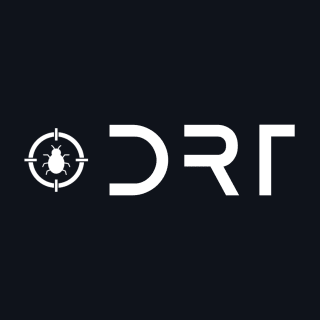

<a name="readme-top"></a>

<div align="center">
  
  <br/>

<h3><b>Portfolio Project</b></h3>

</div>

<!-- TABLE OF CONTENTS -->

# 📗 Table of Contents

- [📖 About the Project](#about-project)
  - [🛠 Built With](#built-with)
    - [Tech Stack](#tech-stack)
    - [Key Features](#key-features)
  - [🚀 Live Demo](#live-demo)
- [💻 Getting Started](#getting-started)
  - [Setup](#setup)
  - [Prerequisites](#prerequisites)
  - [Install](#install)
  - [Usage](#usage)
  - [Run tests](#run-tests)
  - [Deployment](#triangular_flag_on_post-deployment)
- [👥 Authors](#authors)
- [🔭 Future Features](#future-features)
- [🤝 Contributing](#contributing)
- [⭐️ Show your support](#support)
- [🙏 Acknowledgements](#acknowledgements)
- [❓ FAQ (OPTIONAL)](#faq)
- [📝 License](#license)

<!-- PROJECT DESCRIPTION -->

# 📖 Mobile First <a name="about-project"></a>

> Build a mobile-first portfolio website using flex and grid.

## 🛠 Built With <a name="built-with"></a>

### Tech Stack <a name="tech-stack"></a>

- HTML
- CSS

<details>
  <summary>Client</summary>
  <ul>
    <li><a href="https://reactjs.org/">React.js</a></li>
  </ul>
</details>

<details>
  <summary>Server</summary>
  <ul>
    <li><a href="https://expressjs.com/">Express.js</a></li>
  </ul>
</details>

<details>
<summary>Database</summary>
  <ul>
    <li><a href="https://www.postgresql.org/">PostgreSQL</a></li>
  </ul>
</details>

<!-- Features -->

### Key Features <a name="key-features"></a>

> Key features of the application. 

- **Grid to organize parent layout**
- **Flex to organize children content**
- **Mobile First approach**

<p align="right">(<a href="#readme-top">back to top</a>)</p>

<!-- LIVE DEMO -->

## 🚀 Live Demo <a name="live-demo"></a>

> Link to deployed project.

- [Live Demo Link](https://wwwdrt.github.io/mobilefirst/)

<p align="right">(<a href="#readme-top">back to top</a>)</p>

<!-- GETTING STARTED -->

## 💻 Getting Started <a name="getting-started"></a>

> You can use the variables defined in styles.css :root to change the colors of the page. 

### Prerequisites

In order to run this project you need nodejs, you can install it like this:
- Chocolatey package manager in Windows
  - [Chocolatey](https://chocolatey.org/install)
  - `choco install nodejs -y`
- Brew package manager in Mac
  - [Brew](https://brew.sh/)
  - `brew install node -y`
- Linux
  - Debian: `sudo apt install nodejs -y`
  - Arch: `sudo pacman -S nodejs --noconfirm`

### Setup

Clone this repository to your desired folder:

```
cd my-folder
git clone https://github.com/juandapps/mobilefirst.git
```

### Install

> To install project dependencies simply go into the project and 👇

```  cd my-project
  npm install -y
```

### Usage

> To run the project simply open your index.html file in your favorite browser.

### Run tests

To run tests, run the following command:

```
npx hint .
npx stylelint "**/*.{css,scss}"
```

To fix most of the stylelint errors simply run:

```
npx stylelint "**/*.{css,scss}" --fix
```

### Deployment

You can deploy this project using netlify, just follow the steps:

1. Go to netlify.com and login with your github account.
2. Set up your GitHub repository with the netlify app.
3. Select your repository and deploy it.

<p align="right">(<a href="#readme-top">back to top</a>)</p>

<!-- AUTHORS -->

## 👥 Authors <a name="authors"></a>

👤 **Juan**

- GitHub: [@juandapps](https://github.com/juandapps)
- Twitter: [@drtcode](https://twitter.com/drtcode)
- Linktree: [@drtcode](https://linktr.ee/drtcode)

<p align="right">(<a href="#readme-top">back to top</a>)</p>

<!-- FUTURE FEATURES -->

## 🔭 Future Features <a name="future-features"></a>

> Describe 1 - 3 features you will add to the project.

- [ ] **JavaScript accordion functionality**
- [ ] **Scrolling animations**
- [ ] **I will build JavaScript functionality using classes, encapsulation, inheritance, polymorphism, abstraction, 
  and good ES6 practices**

<p align="right">(<a href="#readme-top">back to top</a>)</p>

<!-- CONTRIBUTING -->

## 🤝 Contributing <a name="contributing"></a>

Contributions, issues, and feature requests are welcome!

Feel free to check the [issues page](../../issues/).

<p align="right">(<a href="#readme-top">back to top</a>)</p>

<!-- SUPPORT -->

## ⭐️ Show your support <a name="support"></a>

> If you support this project, please give it a ⭐️!

<p align="right">(<a href="#readme-top">back to top</a>)</p>

<!-- ACKNOWLEDGEMENTS -->

## 🙏 Acknowledgments <a name="acknowledgements"></a>

> I would like to express my sincere gratitude to Microverse for their unwavering support and guidance throughout my
> journey. A special thanks to Nikolas Klener, Ariel Camus, Andrea Funda, Bee Quesada, Luis Valades, Javier Vargas,
> Juan Zorrilla, Mahdi Aghaali, Sandro Hernandez, Temitope Ogunleye, and Amare Kassa, who have been instrumental in my growth as a programmer. Your insightful feedback and encouragement have been invaluable to me. I am also grateful to all the amazing code reviewers I have had the privilege to interact with, and I look forward to continuing these enriching connections. Once again, thank you for everything you've done and continue to do.

<p align="right">(<a href="#readme-top">back to top</a>)</p>

<!-- LICENSE -->

## 📝 License <a name="license"></a>

This project is [MIT](./LICENSE) licensed.


<p align="right">(<a href="#readme-top">back to top</a>)</p>